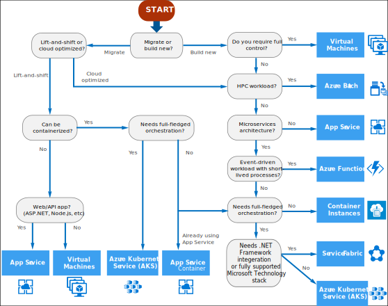

# Correct Compute Service

Definitions:

- **"Lift and shift"** is a strategy for migrating a workload to the cloud without redesigning the application or making code changes. Also called rehosting. For more information, see Azure migration center.
- **Cloud optimized** is a strategy for migrating to the cloud by refactoring an application to take advantage of cloud-native features and capabilities.

